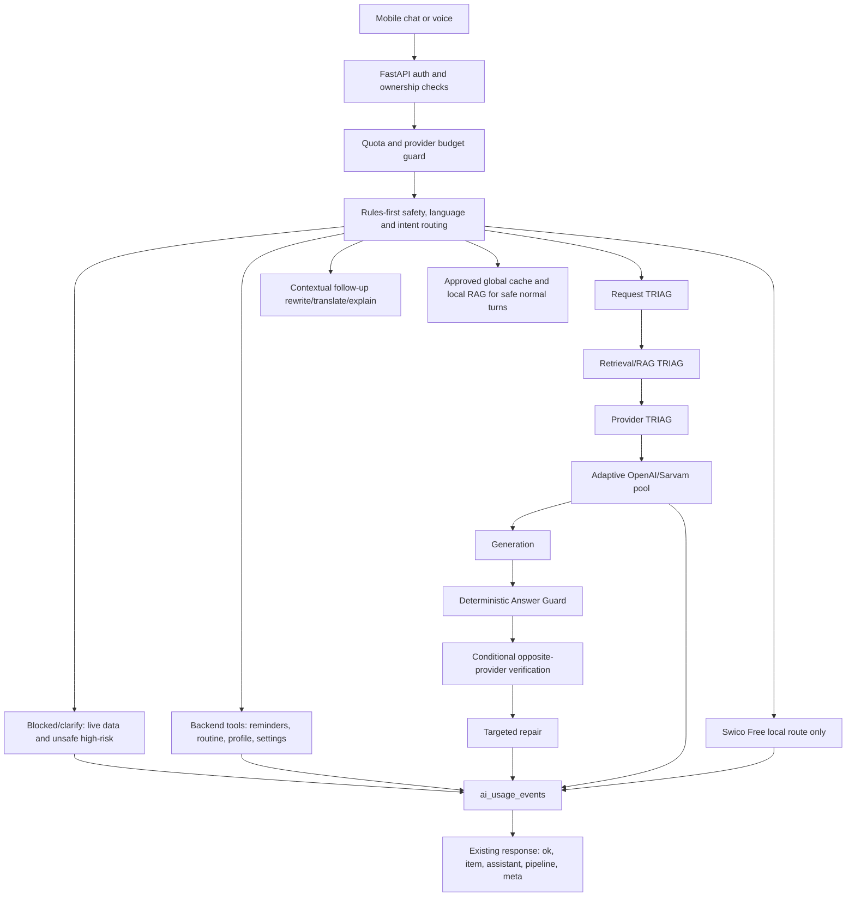

# Swico Website — Updated Target AI Architecture

This document describes the website target architecture. Mobile and legacy
routes retain compatibility behaviour; the rollout-gated provider pool is
website-only.

## Workflow

## Agents

- `AIProviderRouter`: deterministic route selection from language and intent.
- `RequestTriagPlanner` / `RequestPlan`: provider-neutral request intent and
  deterministic/cache/provider decision.
- `RetrievalTriagPlanner` / `EvidencePlan`: bounded evidence confidence,
  lexical-first Lite retrieval, and tier corrective-round limits.
- `ProviderTriagPlanner` / `ProviderExecutionPlan`: selects environment-backed
  aliases using language, capability, health, cost, and tier requirements.
- `MultiProviderBroker`: exposes one primary and one opposite-provider
  alternate; it never performs dual generation by default.
- `ProviderCapabilityRegistry`, `ProviderHealthRegistry`, and
  `ProviderCostEstimator`: bounded selection inputs with no public model data.
- `EmbeddingProviderRouter`: routes paid embeddings through
  `embedding_primary`; Swico Free continues to use local E5.
- `ContextBudgetManager`, `CrossProviderVerifier`, `TargetedAnswerRepair`,
  and `ProviderUsageSettlement`: contracts around the existing prompt,
  guard/repair, usage-stage, and billing implementations.
- `SarvamProvider`: Sarvam chat, STT, and TTS with redacted provider errors.
- `OpenAIProvider`: tracked OpenAI Responses or Chat Completions calls using
  the catalog-driven `OpenAIModelRouter` candidate ladder.
- `openai_catalog`: model endpoint, parameter, pricing, and free-user policy metadata.
- `model_health`: short TTL cache for model access/compatibility failures.
- `run_text_turn`: single-provider orchestrator with safety-before-cache,
  backend tools, contextual follow-ups, and one controlled fallback only after
  provider errors.
- `tools`: rules-only backend actions for reminders, profile, routine, and settings.
- `response_adapter`: maps provider output into the existing pipeline shape.

## Routing Table

| Request type | Website provider alias |
| --- | --- |
| Lite simple English/general | `lite_fast` |
| Lite Indic or code-mixed | `lite_multilingual` |
| Standard simple | `lite_fast` |
| Standard normal/grounded | `standard_balanced` |
| Standard Indic or code-mixed | `standard_multilingual` |
| Pro complex reasoning/coding | `pro_reasoning` |
| Pro Indic reasoning | `pro_multilingual` |
| Image request | `vision_primary` |
| Paid retrieval embeddings | `embedding_primary` |
| Contextual Tamil/Tanglish explain/translate follow-up | Recent chat context -> Sarvam, then OpenAI cheap fallback preserving Tamil |
| Contextual English rewrite/shorten follow-up | Recent chat context -> OpenAI cheap ladder |
| Reminder/routine/profile/settings | Backend tool, no model call |
| STT/TTS | Sarvam `saaras:v3`, `bulbul:v2` default |
| Latest/current/live data for free users | Blocked with clear unavailable message |

Voice uploads use Sarvam Saaras for STT first. The transcript then routes like a
normal text turn: English transcripts go to OpenAI, Indic/Tanglish transcripts go
to Sarvam chat, and backend-tool intents use backend tools.

TTS defaults to Sarvam `bulbul:v2` with speaker `anushka`. `bulbul:v2` must use
one of `anushka`, `abhilash`, `manisha`, `vidya`, `arya`, `karun`, or `hitesh`.
Do not use `shubh` with `bulbul:v2`; Sarvam rejects that speaker/model pair.

## Context And Product Prompts

- `/api/chat` passes only the last 3-6 meaningful user/assistant turns into
  `AIRequest.context_turns`. Usage logs record `context_turn_count`; raw context
  text is not logged unless chat-content logging is explicitly enabled elsewhere.
- Follow-ups such as `Tamil la simple ah explain pannunga`, `Tamil la sollu`,
  `make it shorter`, and `இதை சிம்பிளா சொல்லு` use the previous user question
  and assistant answer. If there is no prior topic, the backend asks a short
  clarification instead of calling a model.
- Reminder clarification is continued from recent context: `Remind me tomorrow
  morning` asks what to remind, and the next short reply such as `Call Amma`
  creates the reminder for the pending time without a provider call.
- Coding, architecture, and product answers receive app context: this is an AI
  mobile app with a backend-first AI router/orchestrator, Sarvam for
  Indic/Tanglish/Tamil plus STT/TTS/translation, OpenAI cheap/reasoning ladders,
  cache, memory/RAG, budgets, usage logs, Firebase auth, rate limits, and safety.
- Default answers use `AI_DEFAULT_ANSWER_STYLE=mobile_concise`; detailed answers
  are allowed when the user asks for detail, step-by-step, full architecture,
  complete code, or a deep dive.

## Env Vars

Core flags: `AI_ROUTER_ENABLED`, `AI_LEGACY_PIPELINE_ENABLED`,
`AI_PROVIDER_ROUTING_MODE`, `AI_MAX_PROVIDER_CALLS_PER_TURN`,
`AI_DEFAULT_ANSWER_STYLE`, `AI_DEFAULT_MAX_BULLETS`,
`AI_DEFAULT_MAX_PARAGRAPHS`, `AI_DETAILED_ANSWER_TRIGGERS`,
`FREE_DAILY_TEXT_LIMIT`, `FREE_DAILY_VOICE_SECONDS`,
`ENABLE_WEB_SEARCH_FOR_FREE`, `ENABLE_OPENAI_FILE_SEARCH`,
`ENABLE_OPENAI_MODERATION`, `AI_ALLOW_OPENAI_TO_SARVAM_FALLBACK`,
`AI_ALLOW_SARVAM_COMPLEX_FALLBACK`.

OpenAI defaults: `OPENAI_API_MODE`, `OPENAI_MODEL`,
`OPENAI_JSON_MODEL`, `OPENAI_MODEL_CHEAP`, `OPENAI_MODEL_STANDARD`,
`OPENAI_MODEL_REASONING`, `OPENAI_MODEL_CHEAP_PRIMARY`,
`OPENAI_MODEL_CHEAP_FALLBACKS`, `OPENAI_MODEL_REASONING_LIGHT_PRIMARY`,
`OPENAI_MODEL_REASONING_PRIMARY`, `OPENAI_MODEL_REASONING_FALLBACKS`,
`OPENAI_MODEL_HARD_REASONING`, `OPENAI_MODEL_HIGH`,
`OPENAI_DISABLE_HIGHEST_MODEL`, `OPENAI_ENABLE_O_SERIES_FOR_FREE`,
`OPENAI_ENABLE_GPT35_EMERGENCY_FALLBACK`, `OPENAI_DISABLED_MODELS`,
`OPENAI_MODEL_PROBE_CACHE_TTL_SECONDS`, `OPENAI_MAX_OUTPUT_TOKENS_DEFAULT`,
`OPENAI_MAX_OUTPUT_TOKENS_HARD`, `OPENAI_DAILY_BUDGET_USD`,
`OPENAI_EMBEDDING_MODEL`.

Embedding controls: `AI_EMBEDDINGS_ON_EVERY_TURN`,
`AI_MAX_EMBEDDING_CALLS_PER_TURN`, `AI_SEMANTIC_CACHE_LOOKUP_ENABLED`,
`AI_SEMANTIC_CACHE_LOOKUP_FOR_SIMPLE_CHAT`, `AI_RAG_LOOKUP_FOR_SIMPLE_CHAT`,
`AI_EMBED_POST_RESPONSE_ASYNC`, `AI_EMBED_POST_RESPONSE_BATCH`.

Sarvam defaults: `SARVAM_CHAT_MODEL`, `SARVAM_CHAT_MODEL_REASONING`,
`SARVAM_CHAT_MAX_TOKENS` (Starter 4096; Pro 16384; Business 128000),
`SARVAM_STT_MODEL`, `SARVAM_STT_MODE`, `SARVAM_TTS_MODEL`,
`SARVAM_TTS_MODEL_PREMIUM`, `SARVAM_TTS_SPEAKER`,
`SARVAM_DAILY_BUDGET_INR`.

New runtime chat requests use `sarvam-105b`. Its current billing rates are
`SARVAM_PRICE_105B_INPUT_INR_PER_1M=29.28`,
`SARVAM_PRICE_105B_CACHED_INPUT_INR_PER_1M=10.98`, and
`SARVAM_PRICE_105B_OUTPUT_INR_PER_1M=73.2`. The 30B rates remain available
only for historical model and pricing snapshots.

Website microphone input remains provider auto-detected. `WEB_STT_MODE` is a
validated fallback: the website resolver uses `translit` only for a saved
Tanglish reply preference and uses `transcribe` for every other supported web
reply language. It never uses the reply preference as an input-language lock.

## Cost Controls

- Free non-admin users are limited by `ai_usage_events` daily text and voice totals.
- Provider budgets stop new provider calls with HTTP 503 when configured spend is exhausted.
- OpenAI flagship/high models stay disabled unless explicitly enabled and allowlisted.
- With `WEB_MULTI_PROVIDER_ROUTING_ENABLED=true`, paid website generation uses
  the configured alias pool, one primary at a time, with an opposite-provider
  verifier/repair only when the tier plan permits it. The rollout flag false
  path retains the existing OpenAI ladder behavior.
- A model that returns access/compatibility 400 is skipped for
  `OPENAI_MODEL_PROBE_CACHE_TTL_SECONDS`.
- OpenAI meta includes `primary_model_candidate`, `selected_model_reason`,
  `skipped_models`, and `model_health_skip_reason` so fallbacks distinguish
  disabled models, health-cache skips, endpoint/access errors, and cost choices.
- Simple chat does not call semantic/RAG embedding paths by default. Exact/global
  cache lookup remains cheap; RAG embedding lookup is reserved for saved
  docs/memory/reusable knowledge intents or explicit env opt-in.
- Text turns use the tier ceiling of one primary plus bounded verifier/repair
  calls; cache/tool/block routes call no model.
- Provider fallback is limited by `AI_MAX_PROVIDER_CALLS_PER_TURN_HARD`; it never
  runs for safety blocks, disabled live data, quota, or budget failures.
- Voice quota is enforced before STT from estimated audio duration and logged in
  `ai_usage_events.audio_seconds`.
- Usage is recorded for provider, cache, tool, STT, TTS, and blocked routes.

## Deployment Checklist

- Run Alembic migration `e7a2c9d5b8f4_add_ai_usage_events`.
- Set `SARVAM_API_KEY` and `OPENAI_API_KEY` in Render or the target backend.
- Keep all public mobile env vars key-free; only backend stores provider secrets.
- Verify `AI_ROUTER_ENABLED=true` and `AI_LEGACY_PIPELINE_ENABLED=false`.
- Keep `LOG_CHAT_CONTENT=false` in production unless explicitly debugging with
  redacted previews.
- Set mobile release env to backend-first:
  `EXPO_PUBLIC_USE_LOCAL_CHAT_PIPELINE=false`,
  `EXPO_PUBLIC_USE_LOCAL_VOICE_PIPELINE=false`, and
  `EXPO_PUBLIC_ENABLE_LOCAL_MODEL_FALLBACK=false`.
- Run backend pytest, mobile typecheck, and mobile vitest before release.
- Manual smoke: send English chat, Tamil/Tanglish chat, reminder creation, TTS,
  and voice STT through a Firebase-authenticated account.
