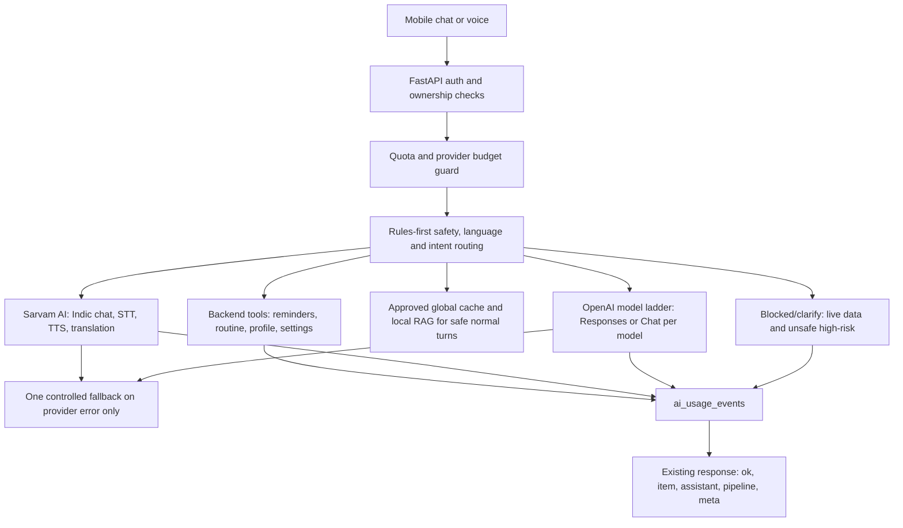

# Backend AI Architecture

## Workflow

## Agents

- `AIProviderRouter`: deterministic route selection from language and intent.
- `SarvamProvider`: Sarvam chat, STT, and TTS with redacted provider errors.
- `OpenAIProvider`: tracked OpenAI Responses or Chat Completions calls using
  the catalog-driven `OpenAIModelRouter` candidate ladder.
- `openai_catalog`: model endpoint, parameter, pricing, and free-user policy metadata.
- `model_health`: short TTL cache for model access/compatibility failures.
- `run_text_turn`: single-provider orchestrator with safety-before-cache,
  backend tools, and one controlled fallback only after provider errors.
- `tools`: rules-only backend actions for reminders, profile, routine, and settings.
- `response_adapter`: maps provider output into the existing pipeline shape.

## Routing Table

| Request type | Provider/model |
| --- | --- |
| Tamil/Indic script or Tanglish/Hinglish | Sarvam `sarvam-30b` |
| Complex Indic reasoning | Sarvam `sarvam-105b` |
| English general chat | OpenAI ladder: `gpt-5-nano` Responses, then `gpt-4.1-nano`, then `gpt-4o-mini` |
| Coding, architecture, debugging | OpenAI ladder: `gpt-5-mini` Responses, then `gpt-4.1-mini`, then `gpt-4o-mini` |
| Reminder/routine/profile/settings | Backend tool, no model call |
| STT/TTS | Sarvam `saaras:v3`, `bulbul:v2` default |
| Latest/current/live data for free users | Blocked with clear unavailable message |

Voice uploads use Sarvam Saaras for STT first. The transcript then routes like a
normal text turn: English transcripts go to OpenAI, Indic/Tanglish transcripts go
to Sarvam chat, and backend-tool intents use backend tools.

## Env Vars

Core flags: `AI_ROUTER_ENABLED`, `AI_LEGACY_PIPELINE_ENABLED`,
`AI_PROVIDER_ROUTING_MODE`, `AI_MAX_PROVIDER_CALLS_PER_TURN`,
`FREE_DAILY_TEXT_LIMIT`, `FREE_DAILY_VOICE_SECONDS`,
`ENABLE_WEB_SEARCH_FOR_FREE`, `ENABLE_OPENAI_FILE_SEARCH`,
`ENABLE_OPENAI_MODERATION`, `AI_ALLOW_OPENAI_TO_SARVAM_FALLBACK`,
`AI_ALLOW_SARVAM_COMPLEX_FALLBACK`.

OpenAI defaults: `OPENAI_API_MODE`, `OPENAI_MODEL`,
`OPENAI_JSON_MODEL`, `OPENAI_MODEL_CHEAP`, `OPENAI_MODEL_STANDARD`,
`OPENAI_MODEL_REASONING`, `OPENAI_MODEL_CHEAP_PRIMARY`,
`OPENAI_MODEL_CHEAP_FALLBACKS`, `OPENAI_MODEL_REASONING_LIGHT_PRIMARY`,
`OPENAI_MODEL_REASONING_PRIMARY`, `OPENAI_MODEL_REASONING_FALLBACKS`,
`OPENAI_MODEL_HARD_REASONING`, `OPENAI_MODEL_HIGH`,
`OPENAI_DISABLE_HIGHEST_MODEL`, `OPENAI_ENABLE_O_SERIES_FOR_FREE`,
`OPENAI_ENABLE_GPT35_EMERGENCY_FALLBACK`, `OPENAI_DISABLED_MODELS`,
`OPENAI_MODEL_PROBE_CACHE_TTL_SECONDS`, `OPENAI_MAX_OUTPUT_TOKENS_DEFAULT`,
`OPENAI_MAX_OUTPUT_TOKENS_HARD`, `OPENAI_DAILY_BUDGET_USD`,
`OPENAI_EMBEDDING_MODEL`.

Embedding controls: `AI_EMBEDDINGS_ON_EVERY_TURN`,
`AI_MAX_EMBEDDING_CALLS_PER_TURN`, `AI_SEMANTIC_CACHE_LOOKUP_ENABLED`,
`AI_SEMANTIC_CACHE_LOOKUP_FOR_SIMPLE_CHAT`, `AI_RAG_LOOKUP_FOR_SIMPLE_CHAT`,
`AI_EMBED_POST_RESPONSE_ASYNC`, `AI_EMBED_POST_RESPONSE_BATCH`.

Sarvam defaults: `SARVAM_CHAT_MODEL`, `SARVAM_CHAT_MODEL_REASONING`,
`SARVAM_STT_MODEL`, `SARVAM_STT_MODE`, `SARVAM_TTS_MODEL`,
`SARVAM_TTS_MODEL_PREMIUM`, `SARVAM_TTS_SPEAKER`,
`SARVAM_DAILY_BUDGET_INR`.

## Cost Controls

- Free non-admin users are limited by `ai_usage_events` daily text and voice totals.
- Provider budgets stop new provider calls with HTTP 503 when configured spend is exhausted.
- OpenAI flagship/high models stay disabled unless explicitly enabled and allowlisted.
- OpenAI generation tries the configured in-provider model ladder before returning
  provider-unavailable. A model that returns access/compatibility 400 is skipped
  for `OPENAI_MODEL_PROBE_CACHE_TTL_SECONDS`.
- Simple chat does not call semantic/RAG embedding paths by default. Exact/global
  cache lookup remains cheap; RAG embedding lookup is reserved for saved
  docs/memory/reusable knowledge intents or explicit env opt-in.
- Text turns use at most one provider call by default. Cache/tool/block routes call no model.
- Provider fallback is limited by `AI_MAX_PROVIDER_CALLS_PER_TURN_HARD`; it never
  runs for safety blocks, disabled live data, quota, or budget failures.
- Voice quota is enforced before STT from estimated audio duration and logged in
  `ai_usage_events.audio_seconds`.
- Usage is recorded for provider, cache, tool, STT, TTS, and blocked routes.

## Deployment Checklist

- Run Alembic migration `e7a2c9d5b8f4_add_ai_usage_events`.
- Set `SARVAM_API_KEY` and `OPENAI_API_KEY` in Render or the target backend.
- Keep all public mobile env vars key-free; only backend stores provider secrets.
- Verify `AI_ROUTER_ENABLED=true` and `AI_LEGACY_PIPELINE_ENABLED=false`.
- Keep `LOG_CHAT_CONTENT=false` in production unless explicitly debugging with
  redacted previews.
- Set mobile release env to backend-first:
  `EXPO_PUBLIC_USE_LOCAL_CHAT_PIPELINE=false`,
  `EXPO_PUBLIC_USE_LOCAL_VOICE_PIPELINE=false`, and
  `EXPO_PUBLIC_ENABLE_LOCAL_MODEL_FALLBACK=false`.
- Run backend pytest, mobile typecheck, and mobile vitest before release.
- Manual smoke: send English chat, Tamil/Tanglish chat, reminder creation, TTS,
  and voice STT through a Firebase-authenticated account.
