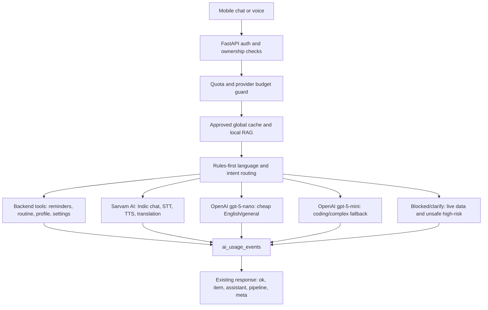

# Backend AI Architecture

## Workflow

## Agents

- `AIProviderRouter`: deterministic route selection from language and intent.
- `SarvamProvider`: Sarvam chat, STT, and TTS with redacted provider errors.
- `OpenAIProvider`: tracked Chat Completions using `OpenAIModelRouter`.
- `run_text_turn`: single-provider orchestrator with cache/tool/block routes.
- `response_adapter`: maps provider output into the existing pipeline shape.

## Routing Table

| Request type | Provider/model |
| --- | --- |
| Tamil/Indic script or Tanglish/Hinglish | Sarvam `sarvam-30b` |
| Complex Indic reasoning | Sarvam `sarvam-105b` |
| English general chat | OpenAI `gpt-5-nano` |
| Coding, architecture, debugging | OpenAI `gpt-5-mini` |
| Reminder/routine/profile/settings | Backend tool, no model call |
| STT/TTS | Sarvam `saaras:v3`, `bulbul:v2` default |
| Latest/current/live data for free users | Blocked with clear unavailable message |

## Env Vars

Core flags: `AI_ROUTER_ENABLED`, `AI_LEGACY_PIPELINE_ENABLED`,
`AI_PROVIDER_ROUTING_MODE`, `AI_MAX_PROVIDER_CALLS_PER_TURN`,
`FREE_DAILY_TEXT_LIMIT`, `FREE_DAILY_VOICE_SECONDS`,
`ENABLE_WEB_SEARCH_FOR_FREE`, `ENABLE_OPENAI_FILE_SEARCH`.

OpenAI defaults: `OPENAI_MODEL`, `OPENAI_JSON_MODEL`,
`OPENAI_MODEL_CHEAP`, `OPENAI_MODEL_STANDARD`, `OPENAI_MODEL_REASONING`,
`OPENAI_MODEL_HIGH`, `OPENAI_DISABLE_HIGHEST_MODEL`,
`OPENAI_MAX_OUTPUT_TOKENS_DEFAULT`, `OPENAI_MAX_OUTPUT_TOKENS_HARD`,
`OPENAI_DAILY_BUDGET_USD`, `OPENAI_EMBEDDING_MODEL`.

Sarvam defaults: `SARVAM_CHAT_MODEL`, `SARVAM_CHAT_MODEL_REASONING`,
`SARVAM_STT_MODEL`, `SARVAM_STT_MODE`, `SARVAM_TTS_MODEL`,
`SARVAM_TTS_MODEL_PREMIUM`, `SARVAM_TTS_SPEAKER`,
`SARVAM_DAILY_BUDGET_INR`.

## Cost Controls

- Free non-admin users are limited by `ai_usage_events` daily text and voice totals.
- Provider budgets stop new provider calls with HTTP 503 when configured spend is exhausted.
- OpenAI flagship/high models stay disabled unless explicitly enabled and allowlisted.
- Text turns use at most one provider call by default. Cache/tool/block routes call no model.
- Usage is recorded for provider, cache, tool, STT, TTS, and blocked routes.

## Deployment Checklist

- Run Alembic migration `e7a2c9d5b8f4_add_ai_usage_events`.
- Set `SARVAM_API_KEY` and `OPENAI_API_KEY` in Render or the target backend.
- Keep all public mobile env vars key-free; only backend stores provider secrets.
- Verify `AI_ROUTER_ENABLED=true` and `AI_LEGACY_PIPELINE_ENABLED=false`.
- Run backend pytest, mobile typecheck, and mobile vitest before release.
